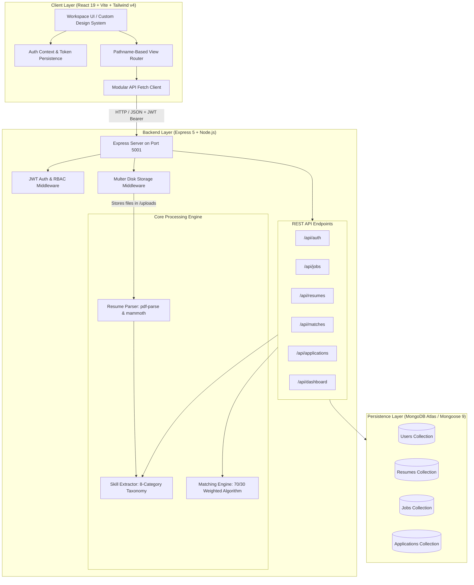
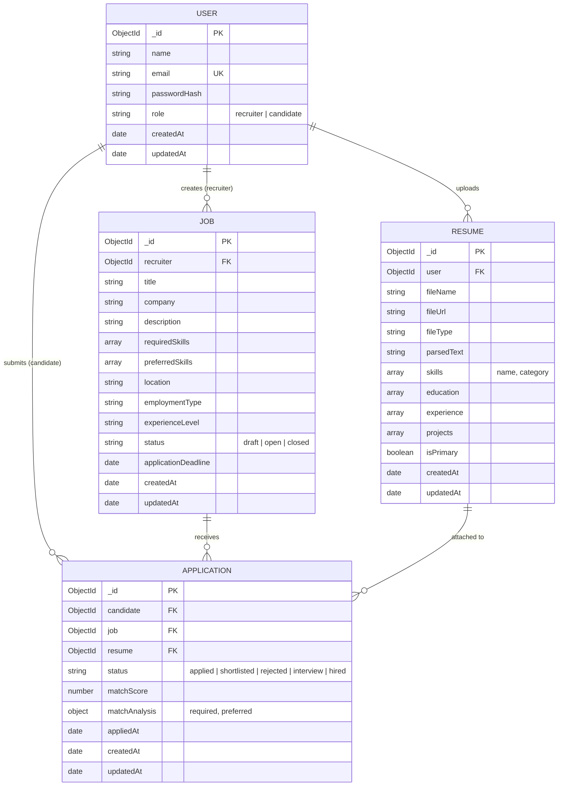
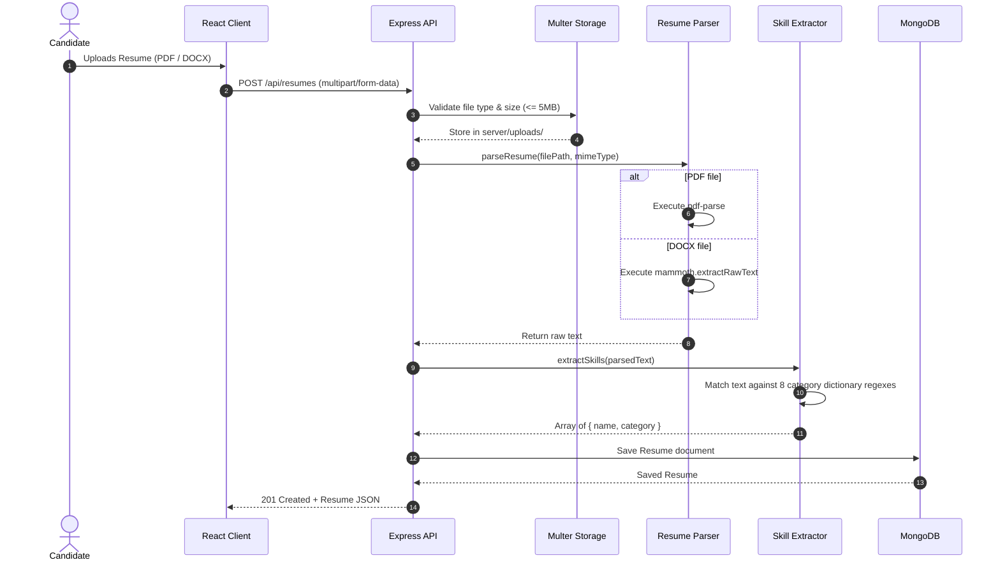
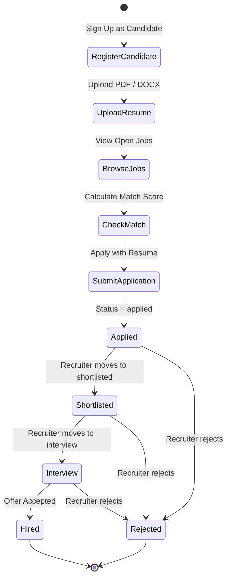
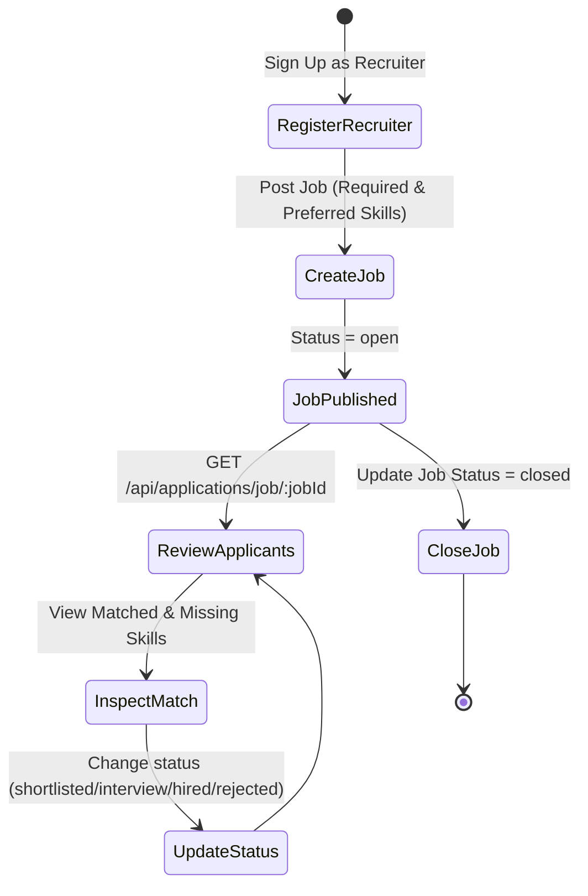

# Smart Resume Matcher

> **An AI-Assisted Recruitment & Resume Screening Platform built with React 19, Express 5, Node.js, and MongoDB.**

[](https://nodejs.org/)
[](https://react.dev/)
[](https://vitejs.dev/)
[](https://expressjs.com/)
[](https://mongoosejs.com/)
[](https://tailwindcss.com/)
[](LICENSE)

---

## 📋 Table of Contents

- [Overview](#-overview)
- [Key Features](#-key-features)
- [System Architecture](#-system-architecture)
- [Technology Stack](#-technology-stack)
- [Database Schema & Data Models](#-database-schema--data-models)
- [Deterministic AI Matching Engine](#-deterministic-ai-matching-engine)
- [Resume Processing & Skill Extraction Pipeline](#-resume-processing--skill-extraction-pipeline)
- [Application & User Workflows](#-application--user-workflows)
- [Frontend Architecture & Routing](#-frontend-architecture--routing)
- [REST API Reference](#-rest-api-reference)
- [Authentication & Security](#-authentication--security)
- [Project Directory Structure](#-project-directory-structure)
- [Installation & Local Setup](#-installation--local-setup)
- [Environment Variables](#-environment-variables)
- [Production Build](#-production-build)
- [Manual Testing Checklist](#-manual-testing-checklist)
- [B.Tech Major Project Viva Guide](#-btech-major-project-viva-guide)
- [Known Limitations & Discovered Inconsistencies](#-known-limitations--discovered-inconsistencies)
- [Future Enhancements](#-future-enhancements)

---

## 🚀 Overview

**Smart Resume Matcher** is a full-stack talent acquisition and resume analysis platform. It streamlines recruitment by automatically parsing unstructured resumes (PDF/DOCX), extracting technical competencies across 8 domain categories, and computing deterministic, mathematically weighted compatibility scores against job postings.

The platform provides dedicated workspaces tailored to two user roles:
1. **Candidates**: Upload resumes, discover open opportunities, run instant pre-application compatibility checks, and track application pipelines in real time.
2. **Recruiters**: Publish job openings with required and preferred criteria, review incoming applicant pools ranked by compatibility score, analyze skill gap breakdowns, and manage recruitment lifecycles from application to hiring.

---

## ✨ Key Features

### For Candidates
- **Resume Parsing & Extraction**: Upload resumes to automatically extract text and identify technical skills across programming languages, web frameworks, databases, DevOps tools, cloud platforms, security tools, and AI libraries.
- **Pre-Application Match Analysis**: Select any uploaded resume and preview the match score, matched skills, and missing required/preferred skills before applying to a job.
- **One-Click Application**: Apply directly with a selected resume. The system records the point-in-time match score and prevents accidental duplicate applications.
- **Application Pipeline Tracker**: View the status of all submitted applications (`applied`, `shortlisted`, `interview`, `hired`, `rejected`).
- **Personalized Candidate Dashboard**: Aggregated overview of total applications, active interviews, top job matches, and extracted skill distribution.

### For Recruiters
- **Job Lifecycle Management**: Create, view, edit, and close job postings with detailed descriptions, location, employment type, experience level, application deadlines, and categorized skill requirements.
- **Ranked Candidate Screening**: Review applicants sorted by match percentage with visual indicators for match strength.
- **Skill Gap & Compatibility Inspection**: Deep-dive into any applicant's submission to inspect exactly which required and preferred skills were satisfied or missing.
- **Hiring Pipeline Pipeline Controls**: Update application stages (`applied` $\rightarrow$ `shortlisted` $\rightarrow$ `interview` $\rightarrow$ `hired` / `rejected`) with immediate database persistence.
- **Job-Level Analytics**: Overview of total applicants, shortlisted counts, average match scores, and hiring stage distributions.

---

## 🏗️ System Architecture

Smart Resume Matcher utilizes a decoupled Client-Server architecture. The frontend Single Page Application (SPA) communicates with the backend Express REST API over HTTP/JSON with JWT Bearer authentication.



---

## 💻 Technology Stack

### Backend
| Technology | Version | Purpose |
| :--- | :--- | :--- |
| **Node.js** | `>= 18.0.0` | Runtime environment |
| **Express** | `^5.2.1` | REST API routing and middleware framework |
| **Mongoose** | `^9.9.4` | MongoDB Object Data Modeling (ODM) |
| **MongoDB / MongoDB Atlas** | `>= 6.0` | Document database |
| **jsonwebtoken** | `^9.0.3` | JWT generation, signing, and verification |
| **bcryptjs** | `^3.0.3` | Password hashing with 10 salt rounds |
| **multer** | `^2.2.0` | Multipart/form-data upload handling (5MB limit) |
| **pdf-parse** | `^2.4.5` | Text extraction from PDF documents |
| **mammoth** | `^1.12.1` | Text extraction from DOCX documents |
| **cors** | `^2.8.6` | Cross-Origin Resource Sharing configuration |
| **dotenv** | `^17.4.2` | Environment variable management |
| **nodemon** | `^3.1.14` | Development hot-reloading |

### Frontend
| Technology | Version | Purpose |
| :--- | :--- | :--- |
| **React** | `^19.2.8` | UI component library |
| **React DOM** | `^19.2.8` | DOM rendering engine |
| **Vite** | `^8.2.2` | Frontend build tool and local dev server |
| **Tailwind CSS** | `^4.3.3` | Utility-first CSS engine (with `@tailwindcss/vite`) |
| **Vanilla CSS** | — | Comprehensive custom design system (`client/src/index.css`) |

---

## 🗄️ Database Schema & Data Models

The data layer is managed via Mongoose schemas with strict field definitions, enum constraints, reference relationships, and unique compound indexes.



### Schema Details

1. **User Schema (`server/models/User.js`)**:
   - `email`: String, trimmed, lowercase, unique index.
   - `role`: String enum (`['recruiter', 'candidate']`), default `'candidate'`.
   - `passwordHash`: String, stores salted bcrypt hash.

2. **Resume Schema (`server/models/Resume.js`)**:
   - `user`: ObjectId referencing `User` (required).
   - `skills`: Array of subdocuments `{ name: String, category: String }`.
   - `parsedText`: Raw extracted text stored for matching and reference.
   - `isPrimary`: Boolean, default `false`.

3. **Job Schema (`server/models/Job.js`)**:
   - `recruiter`: ObjectId referencing `User` (required).
   - `status`: String enum (`['draft', 'open', 'closed']`), default `'open'`.
   - `requiredSkills`: Array of String skill names.
   - `preferredSkills`: Array of String skill names.

4. **Application Schema (`server/models/Application.js`)**:
   - `candidate`: ObjectId referencing `User` (required).
   - `job`: ObjectId referencing `Job` (required).
   - `resume`: ObjectId referencing `Resume` (required).
   - `status`: String enum (`['applied', 'shortlisted', 'rejected', 'interview', 'hired']`), default `'applied'`.
   - `matchScore`: Number (0–100).
   - `matchAnalysis`: Object containing detailed breakdown (`required`, `preferred`).
   - **Compound Unique Index**: `{ candidate: 1, job: 1 }` with `{ unique: true }`. Enforces at database level that a candidate cannot apply to the same job multiple times.

---

## 🧮 Deterministic AI Matching Engine

The matching engine (`server/services/matchingEngine.js`) uses a deterministic, rule-based skill comparison algorithm rather than a non-deterministic generative LLM. This guarantees **100% reproducible, explainable, and auditable** scoring.

### Normalization
All skills (from resumes and job requirements) are normalized prior to comparison:
$$\text{normalize}(s) = s\text{.toLowerCase().trim().replace(/[.\s\_-]+/g, '')}$$

For example:
- `"Node.js"`, `"NodeJS"`, `"node-js"` $\rightarrow$ `"nodejs"`
- `"React.js"`, `"React JS"`, `"React"` $\rightarrow$ `"react"`
- `"RESTful APIs"`, `"REST API"`, `"REST-API"` $\rightarrow$ `"restapi"`

### Mathematical Weighting Formulation

The match calculation applies a **70% weight to Required Skills** and a **30% weight to Preferred Skills**:

$$\text{Required Coverage} = \begin{cases} 1.0 & \text{if } |\text{Required}| = 0 \\ \frac{|\text{Matched Required}|}{|\text{Required}|} & \text{if } |\text{Required}| > 0 \end{cases}$$

$$\text{Preferred Coverage} = \begin{cases} 1.0 & \text{if } |\text{Preferred}| = 0 \\ \frac{|\text{Matched Preferred}|}{|\text{Preferred}|} & \text{if } |\text{Preferred}| > 0 \end{cases}$$

$$\text{Final Score} = \text{round}\Big(\big(\text{Required Coverage} \times 70\big) + \big(\text{Preferred Coverage} \times 30\big), 2\Big)$$

### Match Analysis Output Structure
```json
{
  "score": 85.00,
  "required": {
    "total": 4,
    "matched": 3,
    "coverage": 75.00,
    "matchedSkills": ["JavaScript", "React", "Node.js"],
    "missingSkills": ["TypeScript"]
  },
  "preferred": {
    "total": 2,
    "matched": 2,
    "coverage": 100.00,
    "matchedSkills": ["Docker", "MongoDB"],
    "missingSkills": []
  }
}
```

---

## 📑 Resume Processing & Skill Extraction Pipeline



### Skill Taxonomy Categories (`server/services/skillExtractor.js`)
The skill dictionary classifies identified skills into 8 categories:
1. **Programming**: JavaScript, TypeScript, Python, Java, C, C++, C#, Go, Rust, Ruby, PHP, Swift, Kotlin.
2. **Frontend**: React, Next.js, Vue.js, Angular, Svelte, HTML5, CSS3, Tailwind CSS, Bootstrap, Redux, Sass.
3. **Backend**: Node.js, Express.js, NestJS, Django, Flask, FastAPI, Spring Boot, Ruby on Rails, GraphQL, REST APIs.
4. **Databases**: MongoDB, PostgreSQL, MySQL, Redis, SQLite, Cassandra, Oracle, DynamoDB.
5. **DevOps & Cloud**: Docker, Kubernetes, AWS, Azure, Google Cloud (GCP), CI/CD, GitHub Actions, Terraform, Linux, Nginx.
6. **AI & Machine Learning**: PyTorch, TensorFlow, Scikit-learn, Pandas, NumPy, OpenCV, NLP, LangChain, Keras.
7. **Security**: OWASP, OAuth, JWT, Cryptography, Penetration Testing, IAM.
8. **Tools & Methodologies**: Git, GitHub, GitLab, Jira, Agile, Scrum, Postman, Webpack, Vite.

---

## 🔄 Application & User Workflows

### Candidate Flow: Job Application & Match Verification


### Recruiter Flow: Job Posting & Applicant Review


---

## 🖥️ Frontend Architecture & Routing

### Pathname-Based Routing Engine (`client/src/App.jsx`)
The frontend implements a lightweight, dependency-free routing mechanism based on `window.location.pathname` and `window.location.href` navigation.

| Route Path | Allowed Roles | Component Rendered | Description |
| :--- | :--- | :--- | :--- |
| `/login` | Public | `Login.jsx` | User authentication form |
| `/register` | Public | `Register.jsx` | User registration (Candidate or Recruiter) |
| `/` | Authenticated | `CandidateDashboard.jsx` or `RecruiterDashboard.jsx` | Role-based home dashboard |
| `/jobs` | Candidate | `Jobs.jsx` | Search and discover open opportunities |
| `/jobs/:jobId` | Candidate | `JobDetails.jsx` | Job details, pre-application match analysis, apply |
| `/applications` | Candidate | `Applications.jsx` | Track candidate submitted applications |
| `/resumes` | Candidate | `Resumes.jsx` | Upload and manage resumes |
| `/recruiter/jobs` | Recruiter | `RecruiterJobs.jsx` | Recruiter's posted jobs listing |
| `/recruiter/jobs/create` | Recruiter | `CreateJob.jsx` | Post a new job opportunity |
| `/recruiter/jobs/:jobId` | Recruiter | `ManageJob.jsx` | Edit job, view job stats and ranked applicants |
| `/recruiter/candidates` | Recruiter | `Candidates.jsx` | Overview of all applicants across recruiter's jobs |

### Global State & Authentication (`client/src/context/AuthContext.jsx`)
- Stores current `user` object and JWT `token`.
- Automatically restores session from `localStorage` on initial mount.
- Exposes `login(email, password)`, `register(name, email, password, role)`, and `logout()`.

---

## 🔌 REST API Reference

All API routes are prefixed with `/api`. Protected routes require the header:
```http
Authorization: Bearer <JWT_TOKEN>
```

### 1. Authentication Endpoints (`server/routes/authRoutes.js`)

#### `POST /api/auth/register`
- **Access**: Public
- **Request Body**:
```json
{
  "name": "Alex Johnson",
  "email": "alex@example.com",
  "password": "SecurePassword123!",
  "role": "candidate"
}
```
- **Response (201 Created)**:
```json
{
  "success": true,
  "message": "User registered successfully",
  "token": "eyJhbGciOiJIUzI1NiIsInR5cCI6IkpXVCJ9...",
  "user": {
    "id": "65e01234567890abcdef1234",
    "name": "Alex Johnson",
    "email": "alex@example.com",
    "role": "candidate"
  }
}
```

#### `POST /api/auth/login`
- **Access**: Public
- **Request Body**:
```json
{
  "email": "alex@example.com",
  "password": "SecurePassword123!"
}
```
- **Response (200 OK)**: Returns JWT token and sanitized user profile.

#### `GET /api/auth/me`
- **Access**: Protected (Bearer Token)
- **Response (200 OK)**: Returns profile of current authenticated user.

---

### 2. Resume Endpoints (`server/routes/resumeRoutes.js`)

#### `POST /api/resumes`
- **Access**: Protected (Candidate only)
- **Content-Type**: `multipart/form-data` (`resume` file field)
- **Response (201 Created)**: Parsed resume object with extracted skills array and text.

#### `GET /api/resumes/my`
- **Access**: Protected (Candidate only)
- **Response (200 OK)**: List of all resumes uploaded by the candidate.

#### `GET /api/resumes/:id`
- **Access**: Protected (Owner Candidate or Recruiter reviewing application)
- **Response (200 OK)**: Resume document details.

#### `DELETE /api/resumes/:id`
- **Access**: Protected (Owner Candidate only)
- **Response (200 OK)**: `{ "success": true, "message": "Resume deleted successfully" }`.

---

### 3. Job Endpoints (`server/routes/jobRoutes.js`)

#### `GET /api/jobs`
- **Access**: Protected
- **Query Params**: `search`, `location`, `status`
- **Response (200 OK)**: List of open job postings.

#### `POST /api/jobs`
- **Access**: Protected (Recruiter only)
- **Request Body**:
```json
{
  "title": "Senior Full-Stack Engineer",
  "company": "Tech Innovations Inc.",
  "description": "We are seeking a senior engineer to lead our core platform development.",
  "requiredSkills": ["React", "Node.js", "TypeScript", "MongoDB"],
  "preferredSkills": ["Docker", "AWS", "GraphQL"],
  "location": "Bangalore / Remote",
  "employmentType": "full-time",
  "experienceLevel": "senior",
  "status": "open",
  "applicationDeadline": "2026-12-31T23:59:59.000Z"
}
```
- **Response (201 Created)**: Created job document.

#### `GET /api/jobs/my`
- **Access**: Protected (Recruiter only)
- **Response (200 OK)**: List of jobs posted by the authenticated recruiter.

#### `GET /api/jobs/:id`
- **Access**: Protected
- **Response (200 OK)**: Job document with recruiter profile populated.

#### `PUT /api/jobs/:id`
- **Access**: Protected (Job Owner Recruiter only)
- **Response (200 OK)**: Updated job document.

#### `DELETE /api/jobs/:id`
- **Access**: Protected (Job Owner Recruiter only)
- **Response (200 OK)**: Deleted confirmation.

#### `GET /api/jobs/:id/stats`
- **Access**: Protected (Job Owner Recruiter only)
- **Response (200 OK)**: Aggregated counts for applicants, shortlisted, interviews, and hired.

---

### 4. Application Endpoints (`server/routes/applicationRoutes.js`)

#### `POST /api/applications`
- **Access**: Protected (Candidate only)
- **Request Body**:
```json
{
  "jobId": "65e09876543210fedcba5678",
  "resumeId": "65e011223344556677889900"
}
```
- **Response (201 Created)**: Created application with calculated match score.
- **Error (400 Bad Request)**: Returns `{ "message": "You have already applied for this job" }` if duplicate.

#### `GET /api/applications/my`
- **Access**: Protected (Candidate only)
- **Response (200 OK)**: List of applications submitted by the candidate with populated Job and Resume data.

#### `GET /api/applications/job/:jobId`
- **Access**: Protected (Job Owner Recruiter only)
- **Response (200 OK)**: List of all applicants for the specified job, sorted by match score.

#### `PUT /api/applications/:id/status`
- **Access**: Protected (Recruiter only)
- **Request Body**:
```json
{
  "status": "shortlisted"
}
```
- **Response (200 OK)**: Updated application document.

---

### 5. Matching Endpoints (`server/routes/matchRoutes.js`)

#### `POST /api/matches/calculate`
- **Access**: Protected
- **Request Body**:
```json
{
  "resumeId": "65e011223344556677889900",
  "jobId": "65e09876543210fedcba5678"
}
```
- **Response (200 OK)**: Full match breakdown (`score`, `required`, `preferred`, `matchedSkills`, `missingSkills`).

---

### 6. Dashboard & Health Endpoints

#### `GET /api/dashboard/candidate` (`server/routes/dashboardRoutes.js`)
- **Access**: Protected (Candidate only)
- **Response (200 OK)**: Aggregated statistics (total applications, active interviews, top job matches, skill summary).

#### `GET /api/health` (`server/app.js`)
- **Access**: Public
- **Response (200 OK)**:
```json
{
  "status": "ok",
  "timestamp": "2026-09-02T02:54:00.000Z"
}
```

---

## 🔒 Authentication & Security

1. **Password Protection**: Passwords are hashed using `bcryptjs` with a work factor of 10 salt rounds before database insertion. Plaintext passwords are never logged or stored.
2. **Stateless JWT Authorization**: Requests are authenticated via standard `Bearer <token>` HTTP headers. Tokens are signed using HMAC SHA-256 (`JWT_SECRET`) and validated per-request in `authMiddleware.authenticate`.
3. **Role-Based Access Control (RBAC)**: Endpoints enforce role restrictions via `authMiddleware.authorize('recruiter')` and `authMiddleware.authorize('candidate')`.
4. **Resource Ownership Verification**:
   - Recruiters can only modify, delete, or view applicant analytics for jobs they personally created.
   - Candidates can only view or delete their own uploaded resumes.
5. **Database-Level Idempotency**: The `Application` schema includes a compound unique index `{ candidate: 1, job: 1 }` to prevent race conditions or duplicate submissions.
6. **File Upload Security**:
   - Multer is restricted to a maximum file size of 5MB.
   - MIME type filtering permits only PDF (`application/pdf`) and Word documents (`application/vnd.openxmlformats-officedocument.wordprocessingml.document`, `application/msword`).

---

## 📂 Project Directory Structure

```
smart-resume-matcher/
├── client/                              # Frontend React 19 Application
│   ├── index.html                       # HTML Entry Point
│   ├── package.json                     # Client Dependencies & Scripts
│   ├── vite.config.js                   # Vite Configuration with Tailwind Plugin
│   └── src/
│       ├── main.jsx                     # React DOM Mounting
│       ├── App.jsx                      # Pathname-Based Router & Layout Switcher
│       ├── index.css                    # Shared Workspace Design System & Global Styles
│       ├── api/                         # Client API Integration Modules
│       │   ├── api.js                   # Centralized Fetch Wrapper
│       │   ├── auth.js                  # Authentication Requests
│       │   ├── jobs.js                  # Jobs API Requests
│       │   ├── resumes.js               # Resume Upload & Query Requests
│       │   ├── applications.js          # Application Management Requests
│       │   └── config.js                # API Base URL Config (VITE_API_BASE_URL)
│       ├── context/
│       │   └── AuthContext.jsx          # User Session & JWT State Provider
│       ├── components/
│       │   └── WorkspaceShell.jsx       # Shared Navigation, Sidebar, Metrics & Status Pills
│       └── pages/                       # Application Views
│           ├── Login.jsx                # User Login View
│           ├── Register.jsx             # User Registration View
│           ├── CandidateDashboard.jsx   # Candidate Home Dashboard
│           ├── RecruiterDashboard.jsx   # Recruiter Analytics Dashboard
│           ├── Jobs.jsx                 # Candidate Job Discovery & Search
│           ├── JobDetails.jsx           # Pre-Apply Match Calculation & Application
│           ├── Applications.jsx         # Candidate Application History
│           ├── Resumes.jsx              # Resume Upload & Management
│           ├── RecruiterJobs.jsx        # Recruiter Jobs Listing
│           ├── CreateJob.jsx            # Job Posting View
│           ├── ManageJob.jsx            # Job Editor & Ranked Applicants View
│           ├── Candidates.jsx           # Candidate Overview for Recruiter
│           └── Dashboard.jsx            # Generic Fallback Dashboard
│
├── server/                              # Backend Node.js & Express 5 API
│   ├── package.json                     # Server Dependencies & Scripts
│   ├── server.js                        # Server Entry Point (Port 5001)
│   ├── app.js                           # Express App Configuration & Route Mounting
│   ├── config/
│   │   └── database.js                  # Mongoose Connection Management
│   ├── middleware/
│   │   ├── authMiddleware.js            # JWT Verification & RBAC Guards
│   │   └── uploadMiddleware.js          # Multer File Storage & Validation
│   ├── models/
│   │   ├── User.js                      # User Schema (Candidate / Recruiter)
│   │   ├── Resume.js                    # Resume Schema & Extracted Skills
│   │   ├── Job.js                       # Job Schema & Skill Criteria
│   │   └── Application.js               # Application Schema with Unique Compound Index
│   ├── routes/
│   │   ├── authRoutes.js                # Register, Login, Me
│   │   ├── resumeRoutes.js              # Upload, Get, Delete Resumes
│   │   ├── jobRoutes.js                 # CRUD Jobs & Job Analytics
│   │   ├── applicationRoutes.js         # Submit Application & Update Status
│   │   ├── matchRoutes.js               # Calculate Pre-Application Match
│   │   └── dashboardRoutes.js           # Candidate Dashboard Stats
│   ├── services/
│   │   ├── resumeParser.js              # pdf-parse & mammoth Text Extractor
│   │   ├── skillExtractor.js            # 8-Category Skill Taxonomy Engine
│   │   └── matchingEngine.js            # 70/30 Deterministic Matching Formula
│   ├── utils/
│   │   ├── jwt.js                       # Token Generation Utility
│   │   └── password.js                  # bcryptjs Hashing & Validation
│   └── uploads/                         # Local Directory for Uploaded Files
│
└── README.md                            # Comprehensive System Documentation
```

---

## ⚙️ Installation & Local Setup

### Prerequisites
- **Node.js**: `v18.0.0` or higher
- **npm**: `v9.0.0` or higher
- **MongoDB**: A running local MongoDB instance or a [MongoDB Atlas](https://www.mongodb.com/cloud/atlas) cluster connection URI.

---

### Step 1: Clone the Repository
```bash
git clone https://github.com/jatinverma023/smart-resume-matcher.git
cd smart-resume-matcher
```

---

### Step 2: Configure Server Environment
Create a `.env` file in the `server/` directory:
```bash
# server/.env
PORT=5001
MONGODB_URI=mongodb://localhost:27017/smart-resume-matcher
# Or for MongoDB Atlas:
# MONGODB_URI=mongodb+srv://<username>:<password>@cluster0.mongodb.net/smart-resume-matcher?retryWrites=true&w=majority
JWT_SECRET=your_super_secret_jwt_key_here_change_in_production
JWT_EXPIRES_IN=7d
CLIENT_URL=http://localhost:5173
```

---

### Step 3: Install Server Dependencies & Start Backend
```bash
cd server
npm install
npm run dev
```
*The server will start on `http://localhost:5001`.*

---

### Step 4: Configure Client Environment
Create a `.env` file in the `client/` directory:
```bash
# client/.env
VITE_API_BASE_URL=http://localhost:5001/api
```

---

### Step 5: Install Client Dependencies & Start Frontend
In a new terminal window:
```bash
cd client
npm install
npm run dev
```
*The client dev server will start on `http://localhost:5173`.*

---

## 🔐 Environment Variables

### Server Configuration (`server/.env`)
| Variable | Required | Default | Description |
| :--- | :--- | :--- | :--- |
| `PORT` | No | `5001` | Port number for Express server |
| `MONGODB_URI` | **Yes** | — | MongoDB Atlas or local connection string |
| `JWT_SECRET` | **Yes** | — | Secret key used for signing JWT tokens |
| `JWT_EXPIRES_IN` | No | `7d` | Token expiry duration (e.g. `7d`, `24h`) |
| `CLIENT_URL` | No | `http://localhost:5173` | Allowed CORS origin |

### Client Configuration (`client/.env`)
| Variable | Required | Default | Description |
| :--- | :--- | :--- | :--- |
| `VITE_API_BASE_URL` | **Yes** | `http://localhost:5001/api` | Base URL for Express REST API |

---

## 📦 Production Build

To build the client for production deployment:

```bash
cd client
npm run build
```
This generates optimized static assets in `client/dist/`.

To run the backend in production mode:
```bash
cd server
NODE_ENV=production node server.js
```

---

## 🧪 Manual Testing Checklist

| Step | Action | Expected Result |
| :--- | :--- | :--- |
| 1 | Register candidate account at `/register` | User created with role `candidate`, redirected to dashboard |
| 2 | Upload sample PDF resume at `/resumes` | Resume parsed, skills extracted into categories, listed in UI |
| 3 | Register recruiter account at `/register` | User created with role `recruiter`, redirected to recruiter dashboard |
| 4 | Create job at `/recruiter/jobs/create` | Job created with required/preferred skills, visible at `/jobs` |
| 5 | Switch to candidate, open job at `/jobs` | Job details rendered with required/preferred skill chips |
| 6 | Click "Calculate match" on job details | Match score displayed with matched vs. missing skills breakdown |
| 7 | Click "Apply now" | Application submitted, status changes to "Application submitted" |
| 8 | Try applying again to same job | Prevented by UI and rejected by DB compound index (`candidate_1_job_1`) |
| 9 | Switch to recruiter, open `/recruiter/jobs/:jobId` | Candidate listed with exact match percentage and review options |
| 10 | Update candidate status to `shortlisted` | Status persists and updates in candidate's `/applications` view |

---

## 🎓 B.Tech Major Project Viva Guide

### Elevator Pitch (30 Seconds)
> *"Smart Resume Matcher is an automated recruitment platform that bridges the gap between candidates and recruiters. It ingests unstructured PDF and DOCX resumes, extracts categorized technical skills, and computes an explainable, 70/30 weighted compatibility score against job criteria. This eliminates recruiter screening bottlenecks while giving candidates transparent feedback on skill gaps before applying."*

### Key Technical Talking Points
1. **Why a Deterministic Algorithm over a Generative LLM?**
   - Eliminates hallucination risks and prompt injection vulnerabilities.
   - Provides 100% reproducible and audit-friendly scores required for fair hiring compliance.
   - Zero API inference cost and sub-millisecond execution times.
2. **How is Data Integrity Maintained?**
   - Compound unique index on `{ candidate: 1, job: 1 }` prevents double applications at the database engine level.
   - Strict Mongoose enum validations on roles (`candidate`, `recruiter`) and statuses (`applied`, `shortlisted`, etc.).
3. **How does Text Parsing and Normalization work?**
   - Buffer-based parsing via `pdf-parse` and `mammoth`.
   - String normalization stripping punctuation, whitespace, and case differences allows `React.js`, `ReactJS`, and `React` to resolve to the identical canonical entity.

### Typical Viva Questions & Model Answers

**Q1: How do you handle different file formats for resumes?**  
*Answer:* We use Multer to receive multipart file uploads. The backend inspects the MIME type: if it is `application/pdf`, `pdf-parse` reads the PDF stream; if it is a Word document (`.docx`), `mammoth` extracts raw text. The extracted text is then passed to the canonical skill extraction engine.

**Q2: What is the mathematical formula used for matching?**  
*Answer:* Match Score is a weighted combination: 70% required skill coverage plus 30% preferred skill coverage. Each coverage ratio is the count of matched skills divided by the total requested skills in that category. If a category has no skills listed, coverage defaults to 1.0 (100%).

**Q3: How is security handled for API endpoints?**  
*Answer:* All protected endpoints pass through `authenticate` middleware that decodes the JWT Bearer token and attaches `req.user`. Role-specific routes pass through `authorize('recruiter')` or `authorize('candidate')`. Resource-level ownership checks ensure recruiters can only manage their own jobs and candidates can only delete their own resumes.

---

## 🔍 Known Limitations & Discovered Inconsistencies

During our repository audit, the following implementation characteristics were identified:
1. **Frontend File Picker Filter**: The backend supports both PDF and DOCX (`mammoth`), but the client upload input (`client/src/pages/Resumes.jsx`) restricts file selection via `accept=".pdf,application/pdf"`.
2. **Recruiter Dashboard Aggregation**: The candidate dashboard has a dedicated backend endpoint (`/api/dashboard/candidate`), whereas the recruiter dashboard aggregates metrics client-side by querying `/api/jobs/my` and looping over individual job statistics.
3. **Dual Client API Modules**: The repository contains both a centralized fetch helper (`client/src/api/api.js`) and modular fetch modules (`jobs.js`, `resumes.js`, `applications.js`, `auth.js`). Both connect to `VITE_API_BASE_URL`.
4. **Client-Side Routing**: The application uses custom `window.location.pathname` routing in `App.jsx` instead of a third-party library like `react-router-dom`.

---

## 🔮 Future Enhancements

- [ ] **Semantic Vector Embeddings**: Integrate cosine similarity over sentence embeddings (e.g. HuggingFace / OpenAI embeddings) alongside keyword extraction for contextual job-to-resume matching.
- [ ] **OCR Support**: Add Tesseract.js / AWS Textract for scanned and image-based PDF resumes.
- [ ] **Real-Time Notifications**: WebSocket or Server-Sent Events (SSE) for instant application status updates to candidates.
- [ ] **Automated Email Triggers**: Send automated transactional emails (via Nodemailer / SendGrid) upon application status changes.

---

## 📄 License

This project is licensed under the **MIT License**. Feel free to use, modify, and distribute this codebase for academic and commercial purposes.
